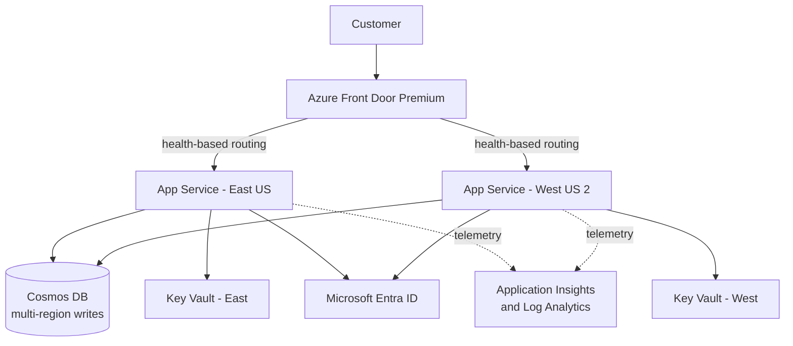

# Resilience Architecture Lab

[](https://github.com/MR3-ux/resilience-architecture-lab/actions/workflows/ci.yml)
[](https://www.python.org/)
[](LICENSE)

Model a cloud system, simulate credible failures, and turn resilience claims into reviewable evidence.

This repository is an engineering portfolio project by **Micah Roberts**. It demonstrates architecture modeling, dependency analysis, RTO/RPO reasoning, failure propagation, operational documentation, test automation, and clear communication of tradeoffs.

## The engineering question

Architecture diagrams show where components are placed. They do not prove what happens when a region, shared dependency, identity provider, or data service fails.

Resilience Architecture Lab asks the harder questions:

- What is the customer-visible result of each failure?
- Which dependencies propagate the outage?
- Is recovery inside the stated RTO?
- Is potential data loss inside the stated RPO?
- Which controls are asserted, and which have evidence?
- Where are the remaining single points of failure?

## What it does

- Validates a version-controlled architecture specification.
- Scores six resilience dimensions on a transparent 100-point model.
- Simulates region and component failures without touching live infrastructure.
- Propagates failures through `all` and `any` dependency policies.
- Separates service-restoration time from estimated data loss.
- Generates Markdown for reviewers and JSON for automation.
- Ships with a strong Azure active-active example and an intentionally fragile comparison.
- Uses only the Python standard library at runtime.

## Quick start

No Azure subscription is required.

```bash
git clone https://github.com/MR3-ux/resilience-architecture-lab.git
cd resilience-architecture-lab

PYTHONPATH=src python3 -m resilience_lab validate examples/azure-active-active.json
PYTHONPATH=src python3 -m resilience_lab assess examples/azure-active-active.json --output-dir reports/demo
PYTHONPATH=src python3 -m resilience_lab simulate examples/azure-active-active.json --scenario east-region-loss
```

Run the test suite:

```bash
PYTHONPATH=src python3 -m unittest discover -s tests -v
```

Or install the local CLI:

```bash
python3 -m venv .venv
source .venv/bin/activate
python3 -m pip install -e .
resilience-lab assess examples/azure-active-active.json --output-dir reports/demo
```

## Demo result

The Azure reference model scores **100/100** on the declared design controls, but scenario testing still exposes an important distinction: total Cosmos DB service loss meets the 30-minute RTO while failing the 5-minute RPO because the documented backup recovery point is 15 minutes.

| Scenario | Customer result | Restore | Data loss | RTO | RPO |
|---|---|---:|---:|---|---|
| East US regional outage | Degraded | 2 min | 1 min | Pass | Pass |
| West US 2 regional outage | Degraded | 2 min | 1 min | Pass | Pass |
| Cosmos DB logical service outage | Outage | 20 min | 15 min | Pass | **Fail** |
| Identity provider outage | Outage | 10 min | 0 min | Pass | Pass |
| Global edge component outage | Outage | 5 min | 0 min | Pass | Pass |

The generated report is checked into [`reports/demo/resilience-assessment.md`](reports/demo/resilience-assessment.md).

## Reference architecture



This is a logical resilience model, not a claim that service labels automatically provide end-to-end availability. Capacity, deployment independence, health probes, runbooks, restore exercises, and game days still require evidence.

## Score model

| Dimension | Points | What the rules inspect |
|---|---:|---|
| Objectives and ownership | 15 | Named owners, business impact, RTO, and RPO |
| Failure-domain redundancy | 20 | Replicas and regional diversity for critical components |
| Detection and failover | 20 | Health checks, automation, and failover time against RTO |
| Data protection | 20 | Replication/backup RPO against the system objective |
| Observability | 15 | Metrics, logs, and alerts on critical components |
| Dependency resilience | 10 | Required dependencies that create hidden SPOFs |

The score is a design-review aid. It is deliberately not marketed as proof of production resilience.

## Repository map

```text
src/resilience_lab/     typed model, validation, simulator, reports, CLI
examples/               resilient and intentionally fragile architectures
schemas/                JSON Schema for editor and pipeline validation
tests/                  propagation, objective, and validation tests
docs/                   architecture, evidence model, checklist, ADRs, runbooks
reports/demo/           reproducible human and machine assessment output
.github/workflows/      continuous integration
```

## Review this like an architect

Start with these questions:

1. Are the entrypoints and critical paths complete?
2. Are `all` versus `any` dependency policies realistic?
3. Are failover and recovery values measured or merely assumed?
4. Does the surviving region have independently tested peak capacity?
5. Can the business operate in a degraded mode when identity or data is unavailable?
6. Is the backup RPO based on a successful restore exercise?

The full checklist is in [`docs/resilience-review-checklist.md`](docs/resilience-review-checklist.md).

## Design boundaries

- Deterministic design simulation is not chaos engineering.
- Cloud control-plane failure and correlated dependency failures need additional scenario types.
- The current engine models availability states, not queue depth, latency, or capacity exhaustion.
- Recovery numbers remain assumptions until backed by rehearsal evidence.

These boundaries are intentional and documented in [ADR-0001](docs/adr/0001-deterministic-offline-simulation.md).

## Roadmap

- Add latency, capacity, and retry-storm modeling.
- Support compound and time-sequenced failures.
- Import dependency evidence from Azure Resource Graph.
- Add signed game-day evidence and trend comparisons between architecture revisions.
- Export a dependency graph and failure-mode matrix as structured artifacts.

Contributions and respectful architecture challenges are welcome. See [CONTRIBUTING.md](CONTRIBUTING.md).
