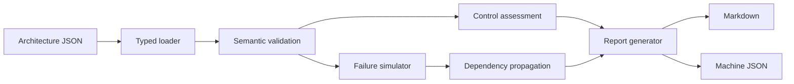

# Architecture

## Purpose

Resilience Architecture Lab is an offline design-analysis tool. It converts an explicit system model into repeatable findings and failure-scenario evidence. The engine never connects to cloud accounts or changes infrastructure.

## Component view

## Domain model

An architecture contains:

- Business context, named owners, and service objectives.
- Customer entrypoints.
- Components, failure domains, replicas, health/failover controls, data controls, and telemetry.
- Directed dependencies with `required` and `dependency_policy` semantics.
- Named failure scenarios.
- Explicit assumptions.

### Dependency policies

- `all`: every required dependency must be available. One unavailable required dependency makes the component unavailable.
- `any`: at least one required dependency must be available. Losing one alternative degrades the component; losing all makes it unavailable.
- Optional dependencies can degrade functionality but do not cause a total component outage.

## Failure algorithm

1. Apply the scenario's direct blast radius.
2. For a regional outage, retain a multi-region component in a degraded state only when another region and automated failover exist.
3. Propagate dependency states until the graph reaches a fixed point.
4. Derive customer status from declared entrypoints and critical components.
5. Compare service-restoration time with RTO.
6. Select the appropriate replication or backup recovery point and compare it with RPO.
7. Preserve component-level reasons as report evidence.

## Trust model

The tool distinguishes assertion from proof:

- The architecture file is an assertion by its author.
- CI proves that the model parses and the deterministic rules behave as tested.
- The generated report proves what the current rules conclude from those assertions.
- Production telemetry, capacity tests, restore tests, and game days are required to prove the assertions themselves.

## Safety

The runtime is standard-library-only, read-only, deterministic, and offline. It does not accept credentials, invoke Azure CLI, or call cloud APIs.
